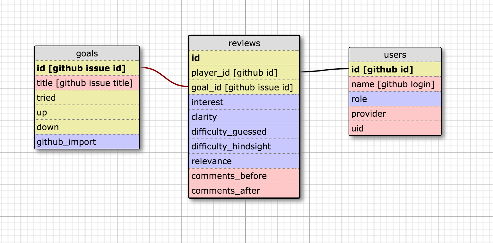

Schema
------

[Load schema info as mihai-goals-viewer and edit](http://ondras.zarovi.cz/sql/demo/)

Requirements
------------

- Ruby 2.2.5
- Rails 5.0.0
- Postgres

Contributing Code
-----------------
If you use this app and can think of ways to improve it, please do so!

* Pick a story from our [Trello board backlog](https://trello.com/b/2a5rVxjK/goal-viewer)
    * Or, write your own story; ask for write access to Trello board
* Create a new branch with a descriptive name
* Don't forget to write specs for it!
* When done, either
  * ...send a pull request
  * ...get a code review on your own, push to development, let bluemihai know
* This is a permissive contribution policy.  Please...
  * do not merge failing specs into development
  * do not push to master without checking in with bluemihai
* Notify bluemihai so he can merge into master and push into production


Setting Up Your Development Environment
---------------------------------------

* Rename database.example.yml to database.yml and fill it out
  * Install Postgres.app or brew install postgres
    * If you use Postgres.app, delete username and password from database.yml
    * If you do not, store your Mac user passwords in it and make sure to .gitignore it
* Get your [Github token](https://github.com/settings/tokens)
  * Maximize all requests (at least I did)
  * For development: Save it into a .env file on its own line: GITHUB_TOKEN=abcd1234
  * For heroku: heroku config set GITHUB_TOKEN = abcd1234
```
  bundle install
  bin/rake db:setup
  bin/rails s
  bundle exec guard
  bundle exec rspec spec/
```
